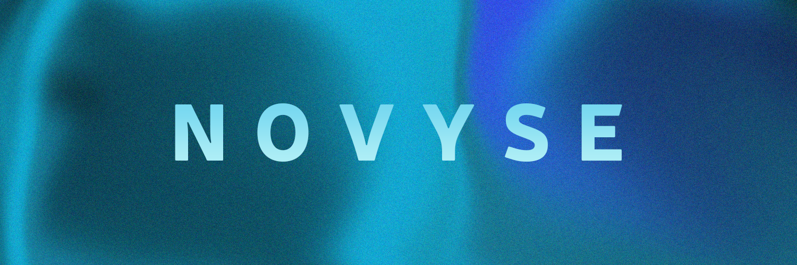
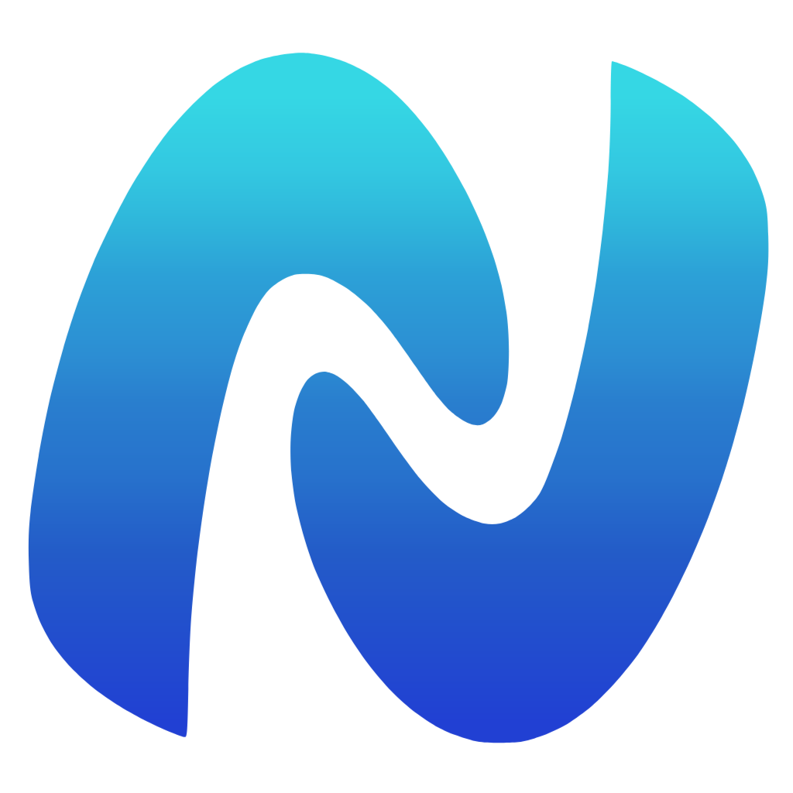

<!-- PROJECT LOGO -->
 

<!-- BANNER -->

 
 

<!-- GITHUB RELATED -->

<!-- SOCIAL RELATED -->

<!-- TECH STACK RELATED -->

 
 

  <!-- LOGO -->
  

  <!-- INTRO -->

  <h1 align="center">Novyse</h1>
  
  

    A simple messaging app done with lots of love!
     
     
    <a href="https://www.novyse.com/#download"><strong>Download</strong></a>
    &middot;
    <a href="https://www.novyse.com">Website</a>
    &middot;
    <a href="https://github.com/Novyse/novyse/issues/new?labels=bug&template=bug-report---.md">Report Bug</a>
    &middot;
    <a href="https://github.com/Novyse/novyse/issues/new?labels=enhancement&template=feature-request---.md">Request Feature</a>
  

> [!WARNING]  
> The application is still in development, even in production versions. User data may be deleted at any time due to server issues, database structure changes, or version updates.

 

<!-- TABLE OF CONTENTS -->

  
Table of Contents

  <ol>
    <li>
      <a href="#about-the-project">About The Project</a>
    </li>
    <li><a href="#updates-and-roadmap">Updates and Roadmap</a></li>
    <li><a href="#preview-version">Preview Version</a></li>
    <li><a href="#contributing">Contributing</a></li>
    <li><a href="#contact">Contact</a></li>
    <li><a href="#license">License</a></li>
    <li><a href="#trademark-notice">Trademark Notice</a></li>
  </ol>

## About The Project

Lorem ipsum dolor sit amet, consectetur adipiscing elit, sed do eiusmod tempor incididunt ut labore et dolore magna aliqua. Ut enim ad minim veniam, quis nostrud exercitation ullamco laboris nisi ut aliquip ex ea commodo consequat. Duis aute irure dolor in reprehenderit in voluptate velit esse cillum dolore eu fugiat nulla pariatur. Excepteur sint occaecat cupidatat non proident, sunt in culpa qui officia deserunt mollit anim id est laborum.

## Updates and Roadmap

All changelogs and patch notes are published on:

- [Twitter (@novyse_official)](https://x.com/novyse_official)
- [Patreon](https://www.patreon.com/cw/Novyse)
- [GitHub Releases](https://github.com/Novyse/novyse/releases)
- [Website](https://www.novyse.com/patchnotes)

Additionally, the website features a complete [roadmap](https://www.novyse.com/roadmap) that is typically updated every Sunday.

## Preview Version

A preview version with new features that are not yet fully tested may be available at [preview.novyse.com](https://preview.novyse.com). We recommend not saving important data on this version, as data may be deleted with version changes, and there could be significant bugs affecting app usage.

### Contributing

We welcome contributions from the community! Whether you're fixing bugs, adding features, or improving documentation, your help is appreciated.

For developers interested in contributing or building the application, refer to the documentation in the `docs/` folder:

- [Build Documentation](docs/build.md): Instructions on how to build the app for different platforms.
- [Developer Setup](docs/dev.md): Guide to set up the local development environment.

### Contact

If you have any questions, suggestions, or need support, feel free to reach out:

- **Website**: [novyse.com](https://www.novyse.com)
- **Twitter**: [@novyse_official](https://x.com/novyse_official)
- **Patreon**: [Support us](https://www.patreon.com/cw/Novyse)
- **GitHub Issues**: [Report bugs or request features](https://github.com/Novyse/novyse/issues)

You can also contact us via email at [contact@novyse.com](mailto:contact@novyse.com)

---

<!-- LICENCE -->

### Licence

This project is licensed under the GNU General Public License v3.0 (GPL-3.0).

GPL-3.0 is a copyleft license that allows you to use, modify, and distribute the software freely, as long as any derivative works are also licensed under GPL-3.0. This ensures that the software remains open source and that improvements are shared with the community.

For more details, please refer to the [LICENSE](LICENSE) file in this repository or visit the [official GPL-3.0 page](https://www.gnu.org/licenses/gpl-3.0.html).

<!-- TRADEMARK -->

### Trademark Notice

**Novyse** and the Novyse logo are trademarks of the original creators.  
The software is open source (GPLv3), but the name and logo are protected.  
Forks or derivative projects must not imply official affiliation.

For more details on trademark usage and guidelines, please refer to [TRADEMARK](TRADEMARK.md).

---

© 2025 Novyse. All rights reserved.

